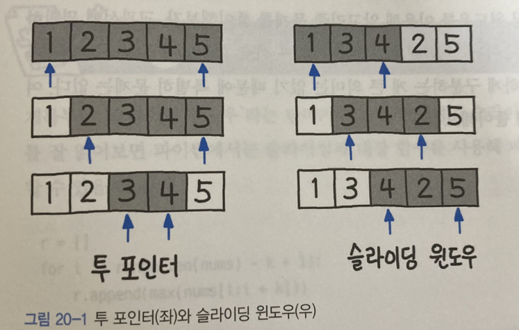

## 슬라이딩 윈도우 알고리즘
- 고정 사이즈의 윈도우가 이동하면서 윈도우 내에 있는 데이터를 이용해 문제를 풀이하는 알고리즘을 말한다.
- 교집합의 정보를 공유하고, 차이가 나는 양쪽 끝 원소만 갱신하는 방법이다.
- 배열이나 리스트의 요소 일정 범위의 값을 비교할 때 사용하면 매우 유용하다.
- 투 포인터 알고리즘과 연동하여 많이 쓰인다.
  - 1차원 배열이 있고 이 배열에서 각자 다른 원소를 가리키는 2개의 포인터를 조작하며 원하는 값을 얻는 형태이다.
