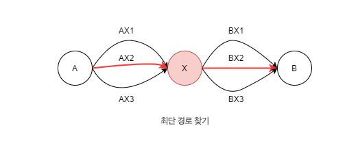

## 슬라이딩 윈도우 알고리즘
- 고정 사이즈의 윈도우가 이동하면서 윈도우 내에 있는 데이터를 이용해 문제를 풀이하는 알고리즘을 말한다.
- 교집합의 정보를 공유하고, 차이가 나는 양쪽 끝 원소만 갱신하는 방법이다.
- 배열이나 리스트의 요소 일정 범위의 값을 비교할 때 사용하면 매우 유용하다.
- 투 포인터 알고리즘과 연동하여 많이 쓰인다.
  - 1차원 배열이 있고 이 배열에서 각자 다른 원소를 가리키는 2개의 포인터를 조작하며 원하는 값을 얻는 형태이다.

## 동적계획법
DP 가 적용되기 위해서는 2가지 조건을 만족해야한다.
1) Overlapping Subproblems (겹치는 부분 문제)
2) Optimal Substructure (최적 부분 구조)

### 1. Overlapping Subproblems (겹치는 부분 문제)
DP 는 기본적으로 문제를 나누고 그 문제의 결과 값을 재활용해서 전체 답을 구한다. 그래서 동일한 작은 문제들이 반복하여 나타나는 경우에 사용이 가능하다. 
즉, DP 는 부분 문제의 결과를 저장하여 재 계산하지 않을 수 있어야 하는데, 해당 부분 문제가 반복적으로 나타나지 않는다면 재사용이 불가능하니 부분 문제가 중복되지 않은 경우에는 사용할 수 없다.

### 2. Optimal Substructure (최적 부분 구조)
부분 문제의 최적 결과 값을 사용해 전체 문제의 최적 결과를 낼 수 있는 경우를 의미한다. 그래서 특정 문제의 정답은 문제의 크기에 상관없이 항상 동일하다.
만약, A-B 까지의 가장 짧은 경로를 찾고자 하는 경우를 에시로 할 때, 중간에 X 가 있을 때, A-X / X-B 가 많은 경로 중 가장 짧은 경로라면 전체 최적 경로도 A-X-B 가 정답이 된다.

위의 그림에서 A-X 사이의 최단 거리는 AX2 이고 X-B 는 BX2 이다. 전체 최단 경로는 AX2-BX2 이다.
다른 경로를 택한다고 해서 전체 최단 경로가 변할 수는 없다.

이와 같이 부분 문제에서 구한 최적 결과가 전체 문제에서도 동일하게 적용되어 결과가 변하지 않을 때 DP 를 사용할 수 있게 된다.
피보나치 수열도 동일하게 이전의 계산 값을 그대로 사용하여 전체 답을 구할 수 있어 최적 부분 구조를 갖고 있다.

### DP 사용하기
DP 는 특정한 경우에 사용하는 알고리즘이 아닌 하나의 방법론이다. 따라서 다양한 문제해결에 쓰일 수 있다.

[DP 를 사용하기 위한 과정]
1) DP 로 풀 수 있는 문제인지 확인한다.
   - 보통 특정 데이터 내 최대화 / 최소화 계산을 하거나 특정 조건 내 데이터를 세야 한다거나 확률 등의 계산의 경우 DP 로 풀 수 있는 경우가 많다.
2) 문제의 변수를 파악한다.
   - DP 는 현재 변수에 따라 그 결과 값을 찾고 그것을 전달하여 재사용하는 것을 거친다.
   - 즉, 문제 내 변수의 개수를 알아내야 한다는 것이고 이것을 영어로 state 를 결정한다고 한다. 
3) 변수 간 관계식을 만든다 (점화식)
  - 짧은 코드 내에서 반복/재귀를 통해 문제가 자동으로 해결되도록 구축할 수 있다.
4) 메모한다 (memoization or tabulation)
   - 변수 간 관계식까지 정상적으로 생성되었다면 변수의 값에 따른 결과를 저장해야한다. 
   - 변수 값에 따른 결과를 저장할 배열 등을 미리 만들고 그 결과가 나올 때마다 배열 내에 저장하고 그 저장된 값을 재사용하는 방식으로 문제를 해결한다.
5) 기저 상태를 파악한다.
   - 가장 작은 문제의 상태를 알아야한다. 
   - 피보나치 수열을 예시로 들면, f(0) = 0, f(1) = 1 과 같은 방식이다.
   - 해당 기저 문제에 대해 파악 후 미리 배열 등에 저장해두면 된다.
6) 구현한다.
   1. Bottom-Up (Tabulation 방식) - 반복문 사용
   2. Top-Down (Memoization 방식) - 재귀 사용

[구현 방법]
1. Bottom-Up 방식
아래에서 부터 계산을 수행하고 누적시켜서 전체 큰 문제를 해결하는 방식이다.
메모를 위해서 dp 라는 배열을 만들고 이것이 1차원이라고 가정했을 때, dp[0]가 기저상태이고 dp[n]을 목표 상태라고 하자. Bottom-Up은 dp[0]부터 시작하여 반복문을 통해 점화식으로 결과를 내서 dp[n]까지 그 값을 전이시켜 재활용하는 방식이다.

Bottom-Up 일 때는 Tabulation 이라고 부른다ㅣ.
반복문을 통해 dp[0]부터 하나 하나씩 채우는 과정을 table-filling 이라고 하며 이 Table 에 저장된 값에 직접 접근하여 재활용하므로 Tabulation 이라는 명칭이 붙었다.

2. Top-Down 방식
dp[0]의 기저 상태에서 출발하는 대신 dp[n]의 값을 찾기 위해 위에서 부터 바로 호출을 시작하여 dp[0]의 상태까지 내려간 다음 해당 결과 값을 재귀를 통해 전이시켜 재활용하는 방식이다.

피보나치의 예시처럼 f(n) = f(n-2) + f(n-1) 의 함수 호출 트리의 과정에서 보이듯,
n=5 일 때 f(3), f(2) 의 동일한 계산이 반복적으로 나오게 된다.

이 때, 이미 이전에 계산ㅇ르 완료한 경우에는 단순히 메모리에 저장되어 있던 내역을 꺼내서 활용하면 된다. 그래서 가장 최근의 상태 값을 메모해 두었다고 하여 Memoization 이라고 부른다.

### 두가지 방법중 더 나은 것이 있을까?
답은 알 수 없다. 실제로 재귀는 내부 스택을 만들고 함수를 호출하는 과정이 더 있어보여서 반복이 빠르다고 느낄 수 있지만
Top-Down 을 통해 문제를 풀어가는 경우에는 점화식에 따라 불필요한 계산을 오히려 Bottom-Up 보다 덜하는 경우가 있기 때문에 문제마다 상황이 다르다.

그 외, Top-Down 은 재귀를 통해 내려가니까 stack 이 쌓여 SOF 와 같은 에러가 발생하지 않을까 하는데 우리 수준의 문제에서는 그러한 경우는 거의 없다.
(하지만 파이썬의 경우 제대로 해도 SOF 가 나올 수 있기 때문에 Bottom-Up 식으로 풀면 된다.)

### Divide and Conquer(분할 정복)과의 차이점은?
분할 정복과 동적 프로그래밍은 주어진 문제를 작게 쪼개서 하위 문제로 해결하고 연계적으로 큰 문제를 해결한다는 점이 같다.
하지만, 분할 정복은 분할된 하위 문제가 동일하게 중복이 일어나지 않는 경우에 쓰이며, 동일한 중복이 일어나면 동적 프로그래밍을 쓴다.

예를 들어 병합정렬의 경우,
수행시에 작은 하위 문제로 쪼개지지만 중복하여 하위 문제가 발생하지 않는다. 분할된 부분 부분은 모두 독립적이고, 동일한 부분을 중복하지 않는다는 것이다.

그렇다면 중복되는 경우를 보면,
피보나치 수열의 경우 n=5 일 때, n-1 은 4이고 n-2 는 3인데 3을 구하기 위해선 n-2 가 1인 경우까지 하위문제로 내려가야한다.
즉, n이 어떤 수이든, 그 하위 수를 구하는 부분은 중복해서 나타난다.

참고: https://hongjw1938.tistory.com/47