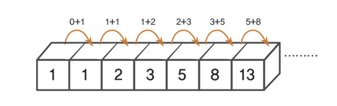

# (완전탐색 & 재귀)

## 완전탐색: 브루트포스 알고리즘
완전 탐색으로 답을 도출하는 알고리즘이며 대부분은 반복문과 조건문을 통하여 답을 도출한다.

<aside>
1️⃣ 피보나치 수열을 구하는 코드를 재귀로 구현하시오.

</aside>



```java
public class 피보나치 {
    public static void main(String[] args) throws IOException {
        BufferedReader br = new BufferedReader(new InputStreamReader(System.in));
        int n = Integer.parseInt(br.readLine());

        System.out.println(fibo(n));
    }

    static int fibo(int n) {
        if(n == 0) return 0;
        if(n == 1) return 1;

        return fibo(n - 1) + fibo(n - 2);
    }
}
```