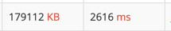

## 1. [18312 - 시각](https://www.acmicpc.net/problem/18312)
### 1) 문제설명
- 00시 00분 00초 부터 N시 59분 59초 까지 모든 시각 중에서 K 가 하나라도 포함되는 시각을 모두 세어 출력한다.
### 2) 접근방식
- 3 중 포문을 이용하여 3개의 반복문을 만든다.
- hhmmss 형태의 문자열을 만들어서 contains 함수로 K 의 유무를 확인하여 개수를 더한다.
### 3) 틀린 이유
- 틀린 것은 아니지만 엄청난 시간이 소요됨

### 4) 올바른 접근 방식 및 해결 방식
참고: https://ddb8036631.github.io/boj/18312_%EC%8B%9C%EA%B0%81/
1. 시간의 특징을 이용한다.
2. 1시간은 3600초 / 1분은 60초
   - K 가 시간에서 매칭되면 00분 00초에서 59분 59초까지 3600번의 매칭결과가 나옴
   - K 가 분에서 매칭되면 00초에서 59초까지 60번의 같은 매칭결과가 나옴
3. 두자리로 표현 가능한 hour 의 어느 한 자리에서 K 가 발견된다면 3600을 더한다.
4. 그렇지않다면 min 을 확인한다.
   - 두 자리로 표현 가능한 min 의 어느 한 자리에서 K 가 발견되면 60을 더한다.
   - 그렇지 않다면 sec 을 확인하며 1씩 더해준다.
### 5) 최종 코드
```java
for (int hour = 0; hour <= N; hour++) {
        if (hour % 10 == K || hour / 10 == K) {
            cnt += 3600;
        } else {
            for (int min = 0; min < 60; min++) {
                if (min % 10 == K || min / 10 == K) {
                    cnt += 60;
                } else {
                    for (int sec = 0; sec < 60; sec++) {
                        if (sec % 10 == K || sec / 10 == K) {
                            cnt++;
                        }
                    }
                }
            }
        }
}
```
위 코드에서 hour 혹은 min에서 K가 발견되면, 아래를 확인하지 않고 각각 3600, 60만큼을 더한 후 넘어간다.
이처럼, 가지치기를 해준 코드는 112ms 밖에 소요되지 않는다.